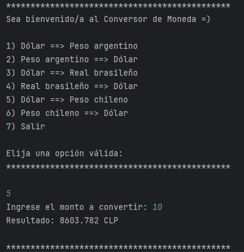

# 💱 Challenge Conversor de Monedas

Aplicación de backend desarrollada en Java que permite realizar conversiones de monedas en tiempo real utilizando una API externa de tasas de cambio.  
El programa se ejecuta completamente en la consola.

---

## 🚀 Funcionalidades

- Conversión entre distintas monedas latinoamericanas y dólar
- Consumo de API externa para tasas de cambio actualizadas
- Interfaz interactiva por consola
- Manejo de errores y validaciones
- Código modular y organizado por clases

---

## 🖥️ Ejecución en consola
Ejemplo del programa funcionando desde la terminal:

---

## 🔄 Conversiones disponibles
- Dólar (USD) ⇄ Peso argentino (ARS)
- Dólar (USD) ⇄ Real brasileño (BRL)
- Dólar (USD) ⇄ Peso chileno (CLP)

---

## 🛠️ Tecnologías utilizadas

- **Java 17**
- **HttpClient (java.net.http)**
- **Gson**
- **ExchangeRate-API**
- **Git & GitHub**

---

## 🔑 Configuración de la API

Este proyecto utiliza la **ExchangeRate-API** para obtener las tasas de conversión.

### Pasos para ejecutar el proyecto:

1. Crear una cuenta en [ExchangeRate-API](https://www.exchangerate-api.com/)
2. Obtener una API Key personal
3. Crear una variable de entorno en el sistema operativo:

    - **Nombre:** `EXCHANGE_API_KEY`
    - **Valor:** tu API Key

4. Reiniciar el IDE
5. Ejecutar la clase `Principal`

> ⚠️ La API Key no está incluida en el repositorio por razones de seguridad.

---

## ▶️ Ejecución

El programa se ejecuta desde la consola y presenta un menú interactivo donde el usuario puede:

1. Seleccionar el tipo de conversión
2. Ingresar el monto
3. Visualizar el resultado en pantalla

---

## 📌 Estado del proyecto

✅ Finalizado  
📚 Proyecto desarrollado como parte de un desafío de aprendizaje en Backend con Java.

---

## 👤 Autor

**Fabián Núñez**  
GitHub: [FabianNunezS](https://github.com/FabianNunezS)